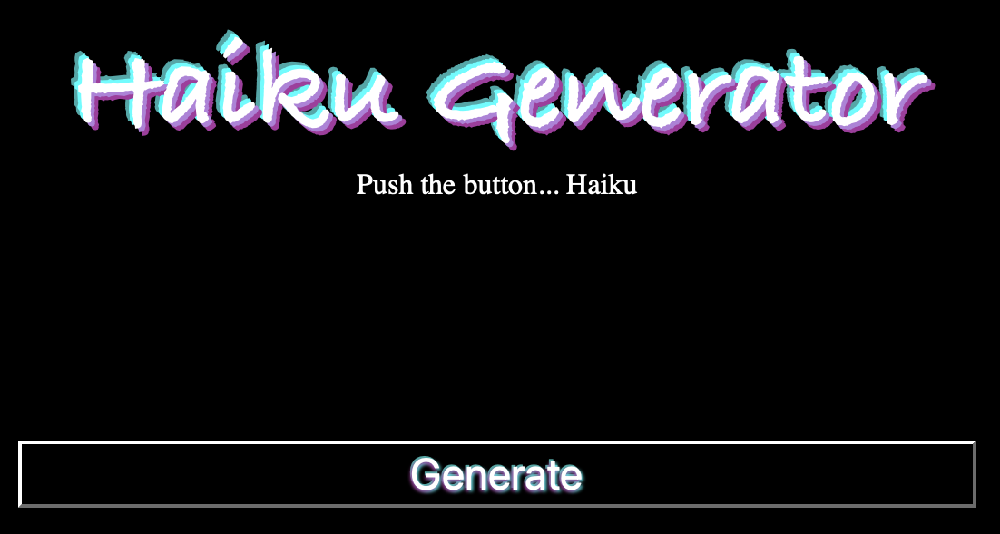

    <h1> Dungeons and Dragons Challenge Rating </h1>

    

        A Web Application for Dungeons and Dragons game master to find monster via challenge rating.
    

	
	
	
	

 

    <h1> Music Generator </h1>

    

        This web application the Spotify Web API to get similar artists to the one you search.  
        This project was created with React, Node JS, Socket IO, and Express JS.
	    
	The site is in the process of being published.
    

	

		
	

 

<a target="_blank"
    href="https://github.com/JonathanTIngram/MusicGenerator"
    >
Source Code
</a>

  

	

    <h1> Haiku Generator </h1>

    

        This web application generates a random haiku with the press of a button.  
        Users also have the option of listening to a playback of the generated haiku. This project was created with NodeJS and Express.
    

	

		
	

    <a target="_blank" 
    href="https://www.haikugenerator.com"> 
    haikugenerator.com </a>

 

<a target="_blank"
    href="https://github.com/JonathanTIngram/HaikuGenerator"
    >
Source Code
</a>

  

    <h1> Automated Chicken Door</h1>

    

        This project utilizes a raspberry pi to control two servo motors to open and close a chicken door. The code to control the servo motors as well as open and close the door at a specific time is written in Python. As the raspberry pi is connected to wifi, it can be remotely accessed via ssh for maintenance.
    

    

        The video below showcases the operation of this door.
    

    

        <video width="200" height="300" controls>

        <source src="assets/videos/chickenDoor.mp4" type="video/mp4">
        Your browser does not support the video tag.
        </video>
    

    

    <a target="_blank"
        href="https://github.com/JonathanTIngram/chickenDoor"
        style="text-decoration: none;">
    Source Code
    </a>
    

     

    <h2> Hardware Used </h2>

    <a target="_blank" 
    href="https://www.adafruit.com/product/2442"> 
    Ada fruit continuous servo motor </a>

    

    <a target="_blank"
    href="https://www.raspberrypi.org/products/raspberry-pi-3-model-b/"> 
    Raspberry Pi 3 model B </a>

